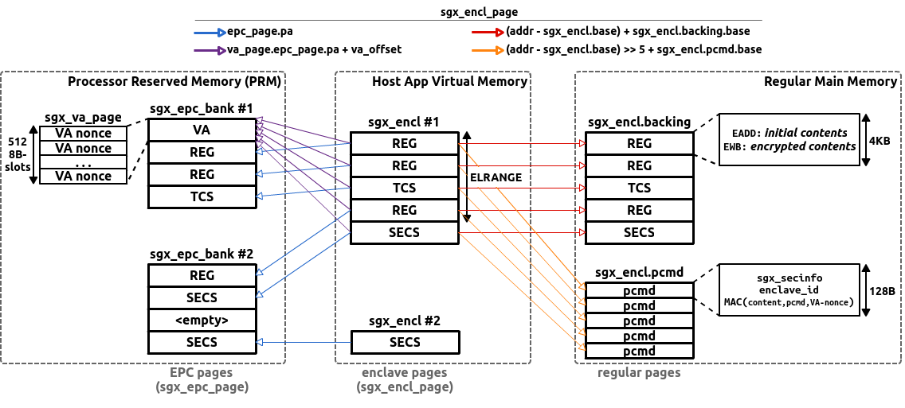
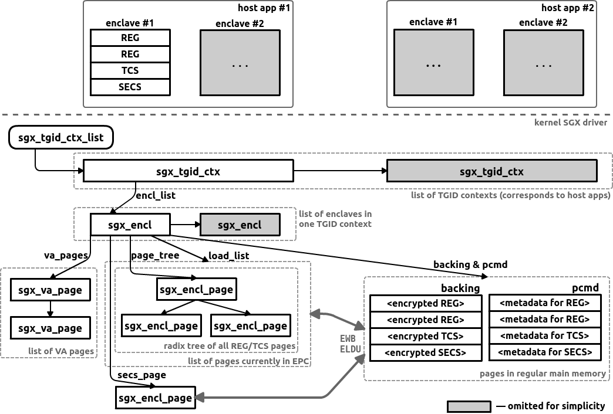

# High-level Overview of Intel SGX Driver for Linux

This is a high-level overview of how the Intel SGX driver works in Linux.
Only the most relevant and non-obvious details are covered here; for low-level implementation details, see comments embedded in code itself.
Also, bugs/issues/todos are reported in this documentation and also in source code (grep for `???`).

This documentation is *unofficial* and written by Dmitrii Kuvaiskii mostly *for educational purposes*.

## Contents

* [SGX memory layout & main structures (this file)](index.md)
* [Driver initialization](init.md)
* [Enclave creation & initialization](ioctl.md)
* [Paging/swapping](paging.md)
* [Inline Asm for ENCLS Privileged Instruction](asm.md)
* [Miscellaneous: Linux kernel info, SGX info](misc.md)

## SGX Memory Layout

Intel SGX introduces an opaque region of memory *Processor Reserved Memory (PRM)*: all data stored in this region is confidentiality- and integrity protected.
Thus, instead of one contigious RAM address space, an SGX-enabled machine sees two separate regions: protected *PRM* and unprotected *regular main memory*.
Since PRM is a limited resource -- with current Intel Skylake/Kaby Lake CPUs having ~100MB of PRM -- Intel SGX allows to evict (swap-out) and load-back enclave pages to/from regular memory.

Typically, the host application creates several enclaves (two in the diagram, each is `sgx_encl` object) in its virtual address space.
Each enclave has its own dedicated range of virtual addresses *ELRANGE* where it stores its *enclave pages*.
Note that ELRANGEs cannot overlap with other enclaves' ELRANGEs or with unprotected app's memory.

Enclave pages residing in ELRANGE can be of three types: regular (REG), Thread-Control Structure (TCS), and SGX Enclave Control Structure (SECS).
REG pages contain normal code & data, TCS pages -- metadata to govern enclave threads, SECS -- metadata to identify & check the whole enclave.
All enclave pages are maintained as `sgx_encl_page` objects in kernel space.

Each enclave has exactly one SECS page.
It is not accessible even from within the enclave, so the SGX driver assigns an out-of-range address to it -- directly after the end of ELRANGE.

PRM can be constituted from a number of EPC banks (`sgx_epc_bank`).
Each EPC bank is a separate device and has its own range of physical device addresses.
Thus, a single enclave's pages can be scattered (in no particular order) among several EPC banks, and pages from several enclaves can end up in one EPC bank.
The physical pages in EPC banks are `sgx_epc_page` objects in the driver terms.

Intel SGX introduces another special type of EPC pages: *Version Array* (VA) pages.
Each VA page contains 512 VA slots; each slot is associated with one REG/TCS/SECS page and keeps a random nonce to protect against replay attacks on page eviction/load-back.
Note that VA pages are not present in ELRANGE, i.e., they cannot be accessed even by the enclave.
The driver creates VA pages lazy on-demand (`sgx_va_page`) and *does not* swap them out (**yes, it should be implemented at some point**).

Finally, since PRM can hold only a limited number of EPC pages at any time, Intel SGX introduces paging mechanisms to swap out unused pages.
For this, the SGX driver allocates two memory regions per each enclave in regular memory: `backing` and `pcmd`.
The `backing` region duplicates ELRANGE and serves two purposes: (1) it contains initial user-supplied contents of REG/TCS pages for initialization of enclave and (2) it stores encrypted enclave pages when they are swapped out.
The `pcmd` region contains Paging Crypto MetaData (PCMD) 128B-sized entries for each enclave page; it is only used for swapped-out pages and prevents from integrity-violation and replay attacks.

## SGX Driver Main Structures

The SGX driver must serve multiple enclaves in multiple processes simultaneously.
Note that in SGX driver terminology, a *process* (or *host app* as I call it) is identified through its *TGID context*.
Recall that each process (host app) has its own `pid` (or `tgid` in kernel terms); the driver queries `tgid` of the current process using `current` global variable.
Thus, each TGID context is associated with one host app.
TGID contexts are needed for two main reasons: (1) swaping out EPC pages from a particular enclave of a particular TGID context and (2) suspending all enclaves in all host apps on hibernation.

The SGX driver maintains a hierarchy of objects:
1. A list of TGID contexts pointed to by `sgx_tgid_ctx_list` and with items of type `sgx_tgid_ctx`
2. For each TGID context, a list of its enclaves pointed to by `sgx_tgid_ctx.encl_list` and with items of type `sgx_encl`
3. For each enclave, several containers of enclave pages:
  - a list of VA pages pointed to by `sgx_encl.va_pages` and with items of type `sgx_va_page`
  - exactly one SECS page pointed to by `sgx_encl.secs_page` and of type `sgx_encl_page`
  - a radix tree of REG/TCS pages pointed to by `sgx_encl.page_tree` and with items of type `sgx_encl_page`
  - a list of currently present (loaded in EPC) pages pointed to by `sgx_encl.load_list`

Note that `sgx_encl.page_tree` contains *all* enclave pages including the swapped-out ones, while `sgx_encl.load_list` contains only those pages which are currently present in EPC.

Since REG/TCS pages as well as the SECS page can be evicted to regular main memory, there are also `sgx_encl.backing` and `sgx_encl.pcmd` memory regions for evicted pages and their metadata.

# TODO

* How to add Resident Set Size (RSS) reporting capability of enclaves? Seems this should be updated in `mm_struct` of `sgx_encl`: http://duartes.org/gustavo/blog/post/how-the-kernel-manages-your-memory/
  - `sgx_encl` needs a page counter that shows SECS + VA pages + REG/TCS pages currently loaded in EPC; there is no such counter yet

