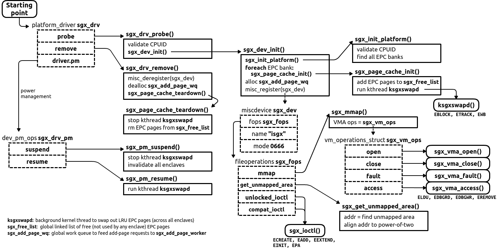

Linux documentation on device API:

* https://lwn.net/Articles/448499/

# SGX Driver Initialization

The SGX driver utilizes Linux's platform device API. The starting point is the `sgx_drv` object which registers callbacks for `probe`, `remove`, and power-management actions.

For initialization, the chain of `sgx_drv_probe()` -> `sgx_dev_init()` -> `sgx_init_platform()` -> `sgx_pache_cache_init()` is used.
The steps for initialization are roughly as follows:
1. Validate that the underlying hardware supports Intel SGX technology, by checking leaves of `CPUID`
2. Find all EPC banks that constitute PRM (Processor Reserved Memory)
3. For each EPC bank, add its EPC pages to the page cache -- global list of free pages `sgx_free_list`
4. Start a background kernel thread `ksgxswapd` that performs EPC pages' swapping to regular main memory
5. Allocate a kernel work queue to asynchronously process add-page requests; a second background kernel thread `sgx_add_page_worker` is used for this
6. Finally, register the device `sgx_dev` which has callbacks for user-space `mmap()`, `ioctl()`, process fork and exit, debug accesses, and page fault handling.

Upon driver removal, the chain of `sgx_drv_remove()` -> `sgx_page_cache_teardown()` is invoked.
The steps are the inverse of those for initialization.

In addition (not shown on diagrams), the driver subscribes to the `mmu_notifier.release` action to mark enclave as dead.
In a nutshell, `mmu_notifier` is used in guest VMs and allows to react on the VM action of destroying the host app (`release`).
The callback `sgx_mmu_notifier_release` simply marks the enclave as dead: `SGX_ENCL_DEAD`.
This allows for a quick exit from add-page, swapping, etc. routines.
The enclave's resources, however, are actually released (all enclave pages removed from the kernel space and EPC) when the enclave's VMA closes (`sgx_vma_close`).
**TODO:** Still unclear why this is needed if the enclave is released only later.

## Understanding PRM and EPC Banks

Obtaining and releasing physical device addesses for EPC pages is encapsulated in `sgx_get_page()` and `sgx_put_page()` respectively.
These addresses can reside in any of the EPC banks, which are detected and registered in an array `sgx_epc_banks` at driver initialization.
Each EPC bank is described by the `sgx_epc_bank` object, with `sgx_epc_bank.start` and `sgx_epc_bank.end` containining a physical memory range of PRM (EPC bank).

Since the driver works with kernel addresses and not physical addresses, it needs a mapping "PRM physical address -> kernel virtual address".
This mapping is achieved by two actions:
1. remapping of each EPC bank's physical base address to get kernel virtual base address: `sgx_epc_bank.mem = ioremap_cache()`;
2. given physical address `pa` and kernel base address, returning the kernel address: `sgx_epc_bank.mem + (pa - sgx_epc_bank.start)`; this functionality is encapsulated in `sgx_get_page()`.

Note how `ioremap_cache()` is used and not `ioremap()` -- this function enables caching of PRM pages in kernel for performance.
Also note that this remapping is only needed for 64-bit mode (**TODO**: 32-bit mode cannot have more than one EPC bank?).

For additional details, see https://software.intel.com/sites/default/files/managed/48/88/329298-002.pdf , see section 1.7.2 (pages 5-6) and https://lwn.net/Articles/282250/ .

## Power Management in Enclaves and SGX Driver

Some documentation on Intel SGX and suspend/hibernate:

> Modern operating systems provide mechanisms for allowing applications to be notified of major power events on the platform. When the platform enters the S3 and S4 power states (suspend to RAM and hibernate to disk), the *keys are erased and all of the enclaves are destroyed*. Enclaves that wish to preserve secrets across S3, S4, and S5 must save state information on disk.
> The Intel SGX architecture does not provide a way of directly messaging the power down event into the enclave. The application may register a callback function for such events. When the callback function is invoked then the application may call the enclave specifically to save secret state to disk for preservation. However, the operating system does not guarantee that the enclave will be given enough time to seal all its internal state. Enclaves that wish to preserve state across power transition events must periodically seal enclave state data outside the enclave (on disk or the cloud). On re-instantiation of the application, the enclave is rebuilt
from scratch and the enclave must retrieve its protected state (from disk or the cloud) inside the enclave.
> 
> -- <cite> https://download.01.org/intel-sgx/linux-1.7/docs/Intel_SGX_Developer_Guide.pdf </cite>

> The protected memory encryption keys that are stored within an SGX-enabled CPU are destroyed with every power event, including suspend and hibernation.
> Thus, when a power transition occurs, the enclave memory will be removed and all enclave data will not be accessible after that. As a result, when the system
resumes, any subsequent ECALL will fail returning the error code `SGX_ERROR_ENCLAVE_LOST`. This specific error code indicates the enclave is lost due to a power transition.
> An SGX application should have the capability to handle any power transition that might occur while the enclave is loaded in protected memory. To handle the power event and resume enclave execution with minimum impact, the application must be prepared to receive the error code `SGX_ERROR_ENCLAVE_LOST` when an ECALL fails. When this happens, *one and only one thread from the application must destroy the enclave*, `sgx_destroy_enclave()`, and *reload it again*, `sgx_create_enclave()`. In addition, to resume execution from where it was when the enclave was destroyed, the application should periodically seal and save enclave state information on the
platform and use this information to restore the enclave to its original state after the enclave is reloaded.
> 
> -- <cite> https://download.01.org/intel-sgx/linux-1.7/docs/Intel_SGX_SDK_Developer_Reference_Linux_1.7_Open_Source.pdf </cite>

According to this, the driver registers power-management (`driver.pm`) callbacks:
1. `sgx_pm_suspend` for suspend/hibernate, for *all current enclaves*:
    - invalidates enclave by removing PTEs for TCS pages
    - marks enclave as dead and suspended thus disallowing any SGX-related actions
    - stops the background `ksgxswapd` thread
2. `sgx_pm_resume` for resume:
    - restarts the background `ksgxswapd` thread

The driver doesn't perform any enclave cleanup (`sgx_encl_release()`).
It is the responsibility of the host application to notice the invalidated enclave, destroy it and create a new one.
Note that invalidated enclaves still consume memory: their EPC pages are not removed, though at some point they are swapped-out and do not consume EPC space.

# Bugs/issues

* **TODO**: Still not sure why `sgx_get_unmapped_area()` is needed.

* `sgx_drv_probe()` and `sgx_init_platform()` both perform the same CPUID validation steps. One of these functions thus seems redundant.

* There is probably a bug in `sgx_dev_init()`:
    - `sgx_page_cache_init()` is called as many times as there are EPC banks
    - but `sgx_page_cache_init()` creates a background thread `ksgxswapd_tsk = kthread_run(ksgxswapd, NULL, "ksgxswapd")` each time it is called
    - thus, there will be several background threads created if there are several EPC banks; only the last one will be known to the driver via global variable `ksgxswapd_tsk`
