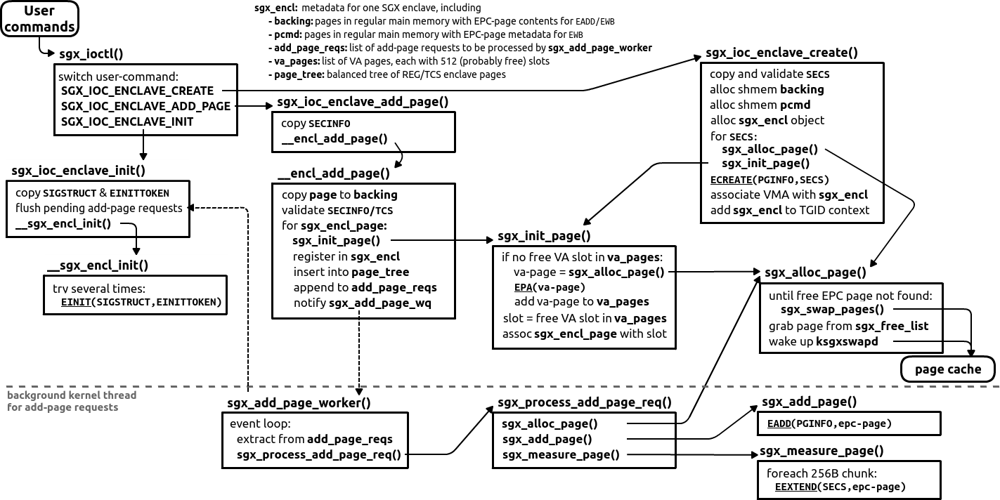

Linux documentation on IOCTL:

* `ioctl` chapter: http://www.makelinux.net/ldd3/chp-6-sect-1
* `unlocked_ioctl` and `compat_ioctl` explanations: https://lwn.net/Articles/119652/

# IOCTL Interface for Enclave Initialization



The host app communicates its "enclave intentions" to the driver using `ioctl()` commands.
There are only three commands:
1. *Enclave creation*: host app requests to create new enclave using `ECREATE`
2. *Enclave page addition*: host app requests to add & measure a new page to the created enclave, proceeding in two steps:
    - first the new page is added using `EADD`
    - then a subset of the 16 256B-chunks (specified in `sgx_enclave_add_page.mrmask`) is measured using `EEXTEND`
3. *Enclave initialization*: host app requests to initialize new enclave using `EINIT`

Note that all other enclave operations are performed in user space (`EENTER`, `ERESUME`, `EEXIT`, `EGETKEY`, `EREPORT`) or using paging/swapping mechanisms (`EBLOCK`, `ETRACK`, `ELDU`, `EWB`).

## IOCTL Code

The driver registers `unlocked_ioctl` and `compat_ioctl` callbacks for the `ioctl()` syscall; both callbacks forward the command to the `sgx_ioctl()` function:
```
long sgx_ioctl(struct file *filep, unsigned int cmd, unsigned long arg);
```

As described above, there are three commands, each with its own IOCTL number:
1. `SGX_IOC_ENCLAVE_CREATE`: calls `sgx_ioc_enclave_create()` with argument `struct sgx_enclave_create`
2. `SGX_IOC_ENCLAVE_ADD_PAGE`: calls `sgx_ioc_enclave_add_page()` with argument `struct sgx_enclave_add_page`
3. `SGX_IOC_ENCLAVE_INIT`: calls `sgx_ioc_enclave_init()` with argument `struct sgx_enclave_init`

Note that all three commands receive one struct argument from the host app and read no data from the driver (so, all IOCTL numbers are defined with `_IOW`).

### sgx_ioc_enclave_create

The function creates the enclave as follows:

1. Copies the user-supplied SECS structure into kernel space and validates it
2. Creates shared-memory (`shmem`) backing regions for EPC pages' content and metadata: `backing` and `pcmd`
3. Creates and initializes an SGX enclave object
4. Finds a free EPC page to serve as SECS page
5. Creates the enclave's SECS page, assigns it a VA slot, sets its address to be right-after ELRANGE, and associates with address of EPC page from (4)
6. Calls `ECREATE` with the created SECS page as input
    - on success, associates user-mmaped VMA with the enclave
    - on failure, releases the enclave object
7. Releases memory of the unneeded SECS structure, allocated at (1)

### sgx_ioc_enclave_add_page

The function add a single user-supplied page to the enclave as follows:

1. Copies the user-supplied SECINFO structure and page into kernel space
2. Validates these structures (SECINFO, TCS page if needed)
3. Prepares objects for the worker thread `sgx_add_page_worker` to pick up and perform actual `EADD+EEXTEND`; the objects are:
    - a temporary copy of the user-supplied page in the `backing` page
    - an `sgx_add_page_req` request with page-info; this request is added to the enclave's worker list `add_page_requests`
4. The worker thread is awaken and picks up the list of add-page requests:
    - Grabs a free physical EPC page and associates it with a virtual enclave page in enclave VMA
    - Adds the page with `EADD`
    - Measures user-specified chunks of the page with `EEXTEND`

### sgx_ioc_enclave_init

The function initializes the enclave as follows:

1. Copies the user-supplied SIGSTRUCT and EINITTOKEN structures into kernel space
2. Flushes pending enclave pages `EADD`ed by the worker thread in background (see above)
3. Calls `EINIT`, retries several times on failure:
    - `EINIT` might fail because of an interrupt storm
    - so first try to spin several times, then try to sleep a bit several times
4. On success, marks the enclave as initialized

Note that after this step, SGX 1.0 disallows adding/measuring new pages.

### Return Values

`sgx_ioctl()` returns one of the following ints:
* `-ENOIOCTLCMD`: if the host app provides a non-recognized (not one of three above) command
* `-EFAULT`: if copying data from the host app (`copy_from_user`) fails
* `-ENOMEM`: if out of memory (cannot `kzalloc`)
* `-EINVAL`: user-supplied argument (one of the SGX structures) is incorrectly filled


## Details on Adding Enclave Pages

### Work Queue for Add-page Requests

Linux introduces a work-queue deferral mechanism: a set of worker threads can wait on a work-queue to process some deferred requests (https://www.ibm.com/developerworks/library/l-tasklets/).
The driver uses this functionality: one `sgx_add_page_worker` waits on the `intel_sgx-add-page-wq` queue for add-page requests from all enclaves.
On `sgx_ioc_enclave_add_page()`, the driver creates an `sgx_add_page_req` request that is added to the enclave's worker list `add_page_work`.
Also, the background worker thread is periodically awakened using `queue_work(sgx_add_page_wq, sgx_encl.add_page_work)`.

### Associating Version Array slots

To add a SECS/TCS/REG page to the enclave, the page must be associated with a corresponding Version Array (VA) page & slot.
Recall that VA slots are needed to prevent replay attacks on swaped-out pages.
The driver associates a VA slot with a new page in `sgx_init_page()` as follows:
* The `sgx_encl` object maintains a list of allocated VA pages `va_pages`
* Each allocated VA page initially contains 512 empty slots, they are filled as new enclave pages are added
* The driver first tries to find an empty VA slot in already allocated `va_pages`
  - if a VA slot is found, it is associated with the new page
  - otherwise, a new VA page is created via `sgx_alloc_page()` -> `EPA` and added to the list of VA pages `va_pages`
  - after the VA page is allocated, its first slot can be associated with the new page

An interesting consequence of this scheme is that VA pages are treated *completely separately*.
They cannot be evicted from EPC and they do not follow a tree-like structure as "Intel SGX Explained" describes in Section 5.5.6.

### Allocating EPC Pages

EPC is a limited resource and can store only a limited number of EPC pages at a time.
Thus, there can be no free space to add a new page.
To cope with this, the driver has a page cache that uses the LRU policy to evict unused EPC pages.
When adding a new page, if there is no free space left in the EPC, the driver invokes `sgx_swap_pages()` until at least one free EPC page is available.
Then the driver can add the new page.
Finally, to make sure there will be free pages in the near future, the driver wakes up the background kernel thread `ksgxswapd`.


# Bugs/issues

* In `sgx_ioctl()`, there is an unused copying-to-host-app (`copy_to_user`).

* `cmd` second argument for functions `sgx_ioc_enclave_create()`, `sgx_ioc_enclave_add_page()`, and `sgx_ioc_enclave_init()` is *useless*

* `EADD` (see `sgx_ioc_enclave_add_page`) is quite inefficient:
  - for each new page, driver searches for the corresponding enclave (via `sgx_find_and_get_encl()`) using expensive locking and `find_vma()`
  - this could be improved using e.g. *one-entry cache* which memorizes the last used enclave and holds lock for it until some timeout/EINIT action (but must be careful to correctly lock/unlock resources)
  - for each new page, driver finds a free VA slot anew (via `sgx_init_page()`) -- in batch mode, could be implemented much faster

* Bad code style: `sgx_put_backing(backing, 0)` must be changed to `sgx_put_backing(backing, false /* write */)`

* `sgx_ioc_enclave_create()` contains dead code: `createp->src = (unsigned long)encl->base`

* `__sgx_encl_init()` contains a useless `continue` statement
