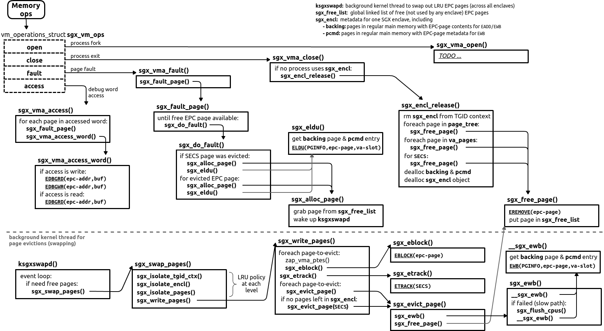

Linux documentation on paging:

* Linux `fault()` functionality: https://lwn.net/Articles/242625/
* https://www.quora.com/What-is-the-difference-between-minor-and-major-page-fault-in-Linux

# Memory Operations in SGX and Paging

Memory operations in SGX include:
* `open` -- when a process (host app) forks, the driver invokes `sgx_vma_open()` (**TODO: what does it do?**)
* `close` -- when a process (host app) terminates, the driver invokes `sgx_vma_close()` to release the enclave
* `fault` -- when a page fault occurs, the driver invokes its custom page fault handler `sgx_vma_fault()` to load-back the evicted EPC page
* `access` -- when ptrace/gdb issues a debug memory access, the driver invokes `sgx_vma_access()` to perform `EDBGRD` or `EDBGWR`

The second important part of the paging mechanism is the `ksgxswapd` background kernel thread.
It waits in an endless loop and periodically swaps out unused EPC pages; see details below.

## Reusing Linux Shared-Memory Virtual FS

The driver conveniently reuses the `shmem` (shared memory virtual file system) functionality.
It allows to move pages between regular main memory and EPC regions.
There are three main uses:
1. Moving backing pages inside EPC with `EADD`
2. Evicting EPC pages' content into backing memory with `EWB` / loading-back EPC page from regular memory with `ELDU`
3. Evicting EPC pages' metadata into backing memory with `EWB` / loading-back this metadata from regular memory with `ELDU`

To this end, at enclave creation (`sgx_ioc_enclave_create`), `shmem_file_setup()` creates two anonymous regular-memory regions (represented as `struct file`):
* `backing` for EPC pages' content
* `pcmd` for EPC pages' metadata (PCMD)

As for sizes of these memory regions, `backing` has the same size as enclave size (`secs.size`) and `pcmd` has `secs.size / 32` since one 4B page keeps 32 128B PCMD entries. (This is slightly simplified; in reality, there is an additional backing page/pcmd entry for evicting SECS.)

The driver encapsulates accesses to these backing shmem regions in `sgx_get_backing()`.
This function can return a physical backing page for both `backing` and `pcmd` regions via a call to `shmem_read_mapping_page_gfp()`.
Whenever an enclave needs to add, evict, or load-back a page, it simply calls `sgx_get_backing()` to find the enclave page's content/PCMD in backing regular memory.

The real convenience of using `shmem` is that the driver does not care about swapping regular-memory pages to slower storage -- this is transparently done by the kernel.
E.g., if an EPC page was swapped to hard disk, the `shmem` module will first load it into regular main memory and then allow access to it.

To clean-up and remove the shared-memory regions, the driver uses `fput()`: `fput(backing)` and `fput(pcmd)`.

## EWB Page Eviction

For page eviction, `EWB` requires three inputs:
1. EPC page virtual address -- enclave page to be evicted
2. Pointer to PAGEINFO struct (four 8B fields, 32B total) with the following fields:
    - `srcpge` containing the physical address of a backing regular-memory page -> encrypted EPC page will be evicted here
    - `linaddr` set to zero; note that EPC page address was given in (1), so this field can be zero
    - `secs` set to zero
    - `pcmd` containing physical address of a corresponding regular-memory page storing PCMD metadata for this EPC page

## Background kernel thread ksgxswapd

There is a `ksgxswapd` daemon that constantly swaps EPC pages to regular main memory if there are less than `sgx_nr_low_pages` free pages.
Thus, in normal case, there are always some free pages in EPC.
In the "overload" case, `ksgxswapd` is not fast enough to swap pages, and `sgx_alloc_page()` signals a `-EBUSY` error.
Upon such an error, the page fault handler in Linux retries again until a free page is available.

In particular, `ksgxswapd` first finds a number of pages (16 in current implementation), performs `EBLOCK` on them, issues `ETRACK` so that SGX double-checks that all relevant CPUs flushed TLB entries with the blocked pages, and finally swaps each page out via `EWB`.
To identify the set of pages to-evict, `ksgxswapd` does the following:
1. Find (isolate) a TGID context which was least recently used
2. Find (isolate) an enclave in this TGID context which was least recently used
3. Find (isolate) a set of pages in this enclave which were least recently used

Note that this strategy uses a simple LRU policy at each step.
For steps 1 and 2, the TGID contexts and enclaves are simply moved to the tail, i.e., there is a simple round-robin policy.
For step 3, all enclave pages benefit from the PTE's Access (A) bit automatically updated by hardware, and thus implement a true LRU policy.

## Paging Crypto MetaData (PCMD)

> Paging Crypto MetaData (PCMD) structure is used to keep track of crypto meta-data associated with a paged-out page. Combined with PAGEINFO, it provides enough information for the processor to verify, decrypt, and reload a paged-out EPC page.
> - EWB writes out (the reserved field and) MAC values.
> - ELDB/U reads the fields and checks the MAC.
> - Contains Enclave ID, SECINFO and MAC
> 
> -- <cite> https://software.intel.com/en-us/blogs/2016/06/10/overview-of-intel-software-guard-extensions-instructions-and-data-structures </cite>

PCMD contains three used and one reserved fields (128B total):
1. `secinfo` is embedded inside PCMD and contains RWX, page-type, etc. flags
2. `enclaveid` is 8B ID of corresponding enclave
3. `mac` is 16B MAC covering (epc-page-contents, secinfo, enclaveid)

`EWB` fills PCMD and stores these 128 bytes unencrypted in a `pcmd` backing page. So, `pcmd` is an output for `EWB`.

`ELDU` loads unencrypted PCMD from the backing pcmd page, checks MAC, and if it is correct, updates EPCM metadata with `PCMD.secinfo`. So, `pcmd` is an input for `ELDU`.

## Version Arrays (VA) during Eviction

In current eviction scheme, VA pages are *never* evicted and can clog EPC:
- VA pages for each enclave are stored separately in a list `sgx_encl.va_pages`
- they are never added/removed in `sgx_encl.page_tree` or `sgx_encl.load_list`
- there is also no special code to evict/load-back them in `sgx_write_pages()`
- in general, current driver uses a flat representation of VA pages and does not build a tree like "Intel SGX Explained" describes in Section 5.5.6

# Bugs/issues

* `sgx_write_pages` contains dead code in the very beginning: `entry = list_first_entry(src, struct sgx_encl_page, load_list)`

